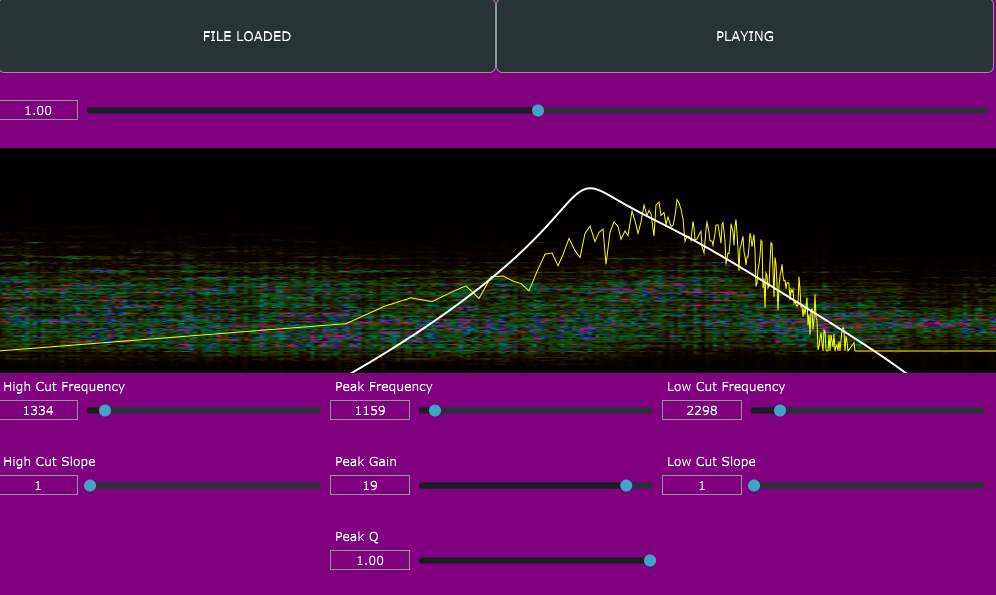

# IIR Filter Analyzer

Note: You will need a copy of JUCE to build this project. You can get it here: https://juce.com/get-juce/download (Tested with JUCE 5.0.7)

# What is this?

Originally made as a project for University in May 2022, I have decided to make this public as it may be useful to someone. Do tread with caution as it is not the best code I have ever written.

This project was my second attempt at making a JUCE application, and my first attempt at making a JUCE application that uses the DSP module. It does contain a few bugs, but it is a decent example of how to use the DSP module to make a simple application.

It is a bit of a proof of concept that uses an IIR filter and shows the effect on an uploaded sound file. The project is intended to help a user understand how IIR filters work.
